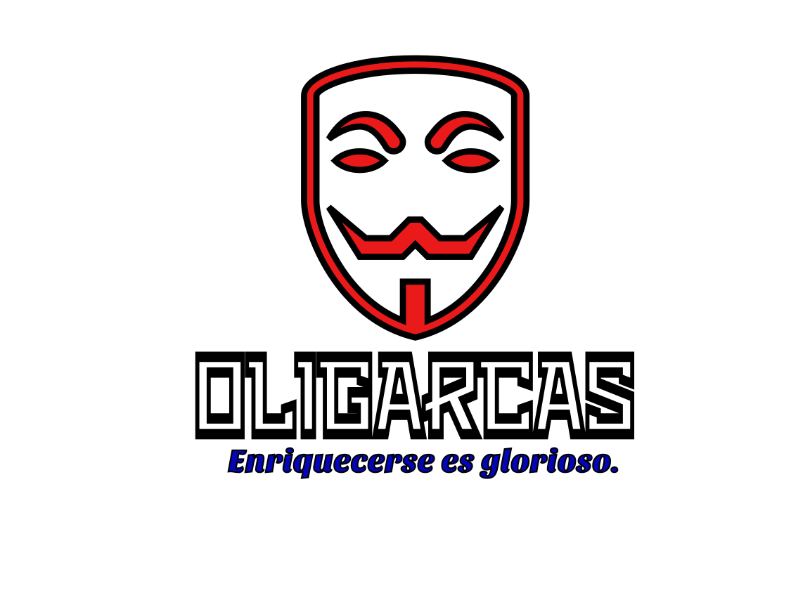

<center></center>  
  

  
## Informacion General:
1. Oligarca es el juego del dinero. Comprarás propiedades, contruirás comercios y condominios, comprarás empresas y 
harás lo que sea para conseguir tu objetivo: hacerte con todo el dinero. Si crees que puedes convertirte en el gran
oligarca dominante, si deseas probar tu suerte y tus habilidades, juega Oligarca con tu amigos y así sabrás quien de 
todos merece ser el único oligarca.
2. Como todo juego de mesa de comprar propiedades, Oligarca se juega con fichas en un recorrido de casillas, y será la 
suerte de un par de dados de seis caras lo que decida que casilla podrá ocupar tu ficha. Este juego está basado en
cantones y empresas de Costa Rica. Podrás comprar propiedades y empresas, y con tu dinero podrás decidir si quieres
invertir en un comercio o en un condominio. 
3. En oligarga están representados algunos de los cantones más desarrollados de cada provincia de Costa Rica. Entre más
población tiene cada provincia, más cantones posee en el juego. Limón, la provincia menos poblada de Costa Rica cuenta
con solo 3 cantones. San José, la provincia más poblada de Costa Rica cuenta con 10 cantones. Las propiedades de cada 
provincia están distinguidas por un color.

### El Inicio de Juego: 
4. Al iniciar el juego debe repartirse 40 000 colones entre todos los jugadores. Debe repartirse igual
cantidad de dinero entre todos los jugadores.
5. Todos los jugadores deben lanzar los dados. El primero en lanzar los dados será el jugador que logre un número mayor. 
El orden de los demás jugadores se definirá del primero a la derecha, formando un circulo entre todos los jugadores que formen
parte del juego.
6. La primera vuelta del recorrido será solo para definir cuáles jugadores tendrán el privilegio de comprar primero. Durante 
esta vuelta no se podrá comprar propiedades o empresas, no se podrá tomar tarjetas de "Mal Negocio" o "Buen Negocio", ni 
tampoco se podrá ganar la loteria.
7. Después de haber dado la primer vuelta al recorrido, los jugadores podrán comprar las propiedades que su ficha visite. 
Cada vez que caes enuna propiedad, podrás comprarla o podrás subastarla entre los demás jugadores. El precio inicial debe ser
el precio indicado en el tablero.

### Buen Negocio y Mal Negocio
8. Tu camino al dinero está lleno de jiro inesperados y contratiempos. Cada vez que tu ficha caiga en un Mal Negocio, deberás
leer una tarjeta de Mal Negocio y atenerte a pagar la factura de tu desdicha. Pero si tu ficha llega a visitar un Buen Negocio,
podrás tomar una tarjeta de Buen Negocio y recibir algo que de seguro será bueno.
9. Cada vez que un jugador visite un Buen Negocio o Mal Negocio, deberá pagar 100 colones al fondo de la loteria. El fondo de 
loteria está en en centro del juego. La persona que caiga en la casilla Loteria ganará el dinero que este acumulado en el fondo
de la Loteria.

### Calificación de las Propiedades
10. Las 45 casillas están calificadas según su nivel de rentabilidad en A, B, C y D. Las 5 empresas de nivel A pagan el 150%
de la inversión. Hay 2 medios de comunicación rango A que no reintegran la inversión, pero su beneficio es otro (Leer Medios de 
Cominucación) Las propiedades rango B también pagan el 150% de la inversión. Las propiedades rango C pagan un 100% de la
inversión y las propiedades rango D pagan solo un 50% de la inversión.
11. Cuando compres una propiedad recibirás un cartón donde se te indicará cuanto cuesta un comercio o un condominio. Solo puedes
construir un comercio o un condominio. Una vez que tengas construido un comercio o un comdominio, no podrás demoler para vender
el edificio o para construiri otra cosa. Piensa con cuidado si quieres comercio o condominio. Los condominios pagan más que los
comercios, pero también cuestan más.

### Los Medios de Comunicación:
12. Si compras un medio de comunicación, podrás librarte de los Mal Negocio, pero igual pagarás los 100 colones al fondo de la
loteria. Si controlas los dos medios de comunicación tendrás un poder muy especial: podrás tomar una tarjeta de Mal Negocio 
(cuando tu ficha cae en Mal Negocio), podrás leerla y podrás hacer una de las dos siguientes cosas:
A-Podrás decidir a que jugador le tocará recibir ese Mal Negocio.
B-Podras chantagear a otro jugador, para que te pague una cantidad convinida y así motivarte a desechar la tarjeta de Mal 
Negocio que tienes para usas como arma.

### La Loteria:
13. El jugador que cae en loteria se gana el fondo de la loteria. Deberán colocarse 2000 colones siempre en el fondo de la 
loteria más 100 colones cada vez que se cae el buen negocio o mal negocio.

### El Dominio de Provincia:
14. Cuando un jugador posee la mitad o más de las propiedades de una misma provincia, este jugador tiene dominio sobre esta 
provincia. Tener dominio obre una provincia te la los siguientes poderes:
A-Puedes comprar todas las propiedades de esta provincia, aunque tu ficha no visite ese lugar. Si otro jugador posea una o
más propiedades de esa provincia, podrás exigir que te venda esa propiedad el ese jugador no se podrá negar. Deberas pagarle
la misma cantidad que el/ella pagó por propiedad y contrucción. (Según el pricio del juego y no uno convenido con otro 
jugador)
B-Puede permitir que otro jugador compre alguna de las propiedades de esa provincia, negociando algún beneficio.        

### Cómo Ganar:
15. El ganador será el primero jugador que cumpla una de las siguientes condiciones:
A-  El primer jugador en poseer 18 titulos de propiedad (La Mitad de todas los propiedades)
B- El primero jugador en Dominar 3 de las 5 empresas (Los Medios de Comunicación no son empresas)
C- El Primer jugador en dominar 4 de las 7 provincias de Costa Rica.
D- El primer jugador en dominar 3 de las 4 provincias centrales de Costa Rica. (Las provincias centrales son la cuarta, quinta,
sexta y séptima; que corresponden a Heredia, Cartago, Alajuela y San José respectivamente.)


    
## Instrucciones para desarrollo:
- Instalar Python3
```console
 foo@bar:~$ sudo apt install python3
 ```
- instalar Python3-pip
```console
 foo@bar:~$ sudo apt install python3-pip
 ```
- Instalar numpy con pip: 
```console
 foo@bar:~$ pip3 install numpy
 ```
 - Se recomienda utilizar un editor como VSCode, atom, o un IDE de Brainstorm.
 

  
## Tecnologias utilizadas:
- Python3(necesita estar instalado)

